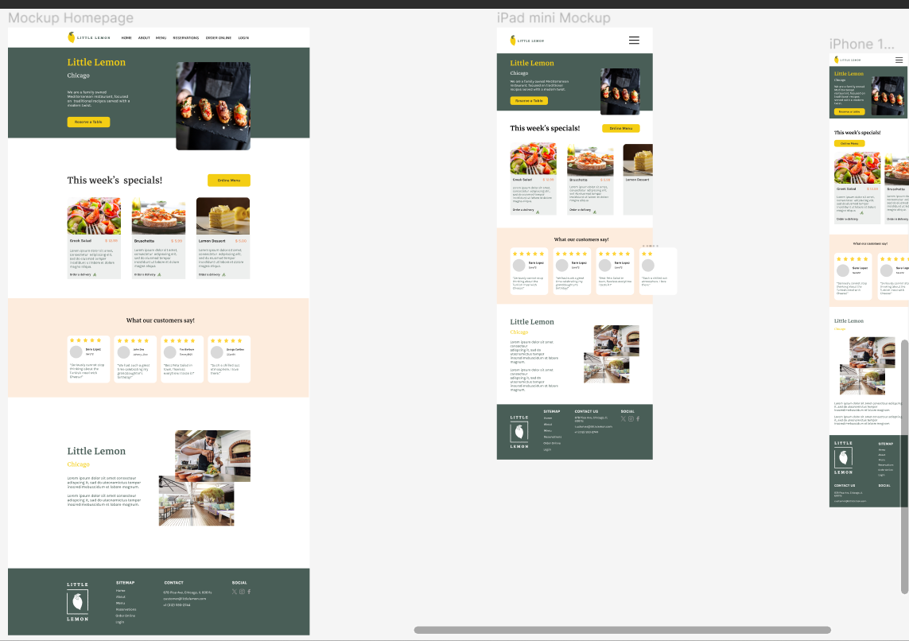

# Little Lemon Restaurant Webapp

## Introduction

This is the Project Capstone of the Meta Front-end Developer Professional Certification by Coursera, which is a specialization developed by Meta.

In this project, you’ll find semantic HTML, meta tags and Open Graph protocol. You’ll see a responsive website, designed for mobile, tablet and desktop devices.

The UI prototypes were designed in Figma by me, as follows:

In progress:
- Code the table booking system using ReactJS with form validation
- Create the pages other than Homepage and Reservation

To do:
- Write unit tests
